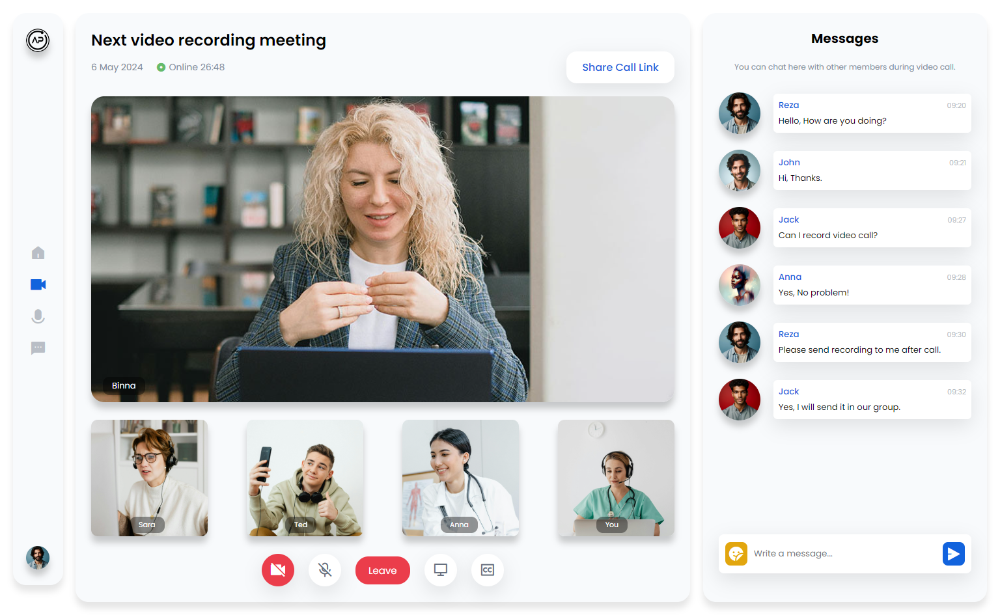

# Meeting Platform UI

In this tutorial ([Open in Youtube](https://youtu.be/RKF6mjX8sTU)), 🚀 Get ready to elevate your coding skills as we dive into the exciting world of video call (meeting) platforms! 🌟 In this tutorial, we'll guide you through the process of creating a sleek and intuitive interface using HTML and CSS. Whether you're a coding newbie or a seasoned developer, there's something here for you!

🎨 We'll start by laying the foundation with HTML, building the structure for our video call interface. Then, we'll sprinkle some CSS magic to style it up, ensuring it looks modern and professional. 💻 From sleek buttons to stylish layouts, we'll cover it all!

📱Worried about responsiveness? Don't be! We'll show you how to make your design adapt seamlessly to various screen sizes, making sure your users have a fantastic experience no matter what device they're on. 📱💼

👩‍💻 Whether you're creating a platform for remote work, virtual classrooms, or simply connecting with friends and family, mastering the art of video call interfaces is essential. And with our step-by-step guide, you'll be a pro in no time! 🌐💬

# Screenshot
Here we have project screenshot :

